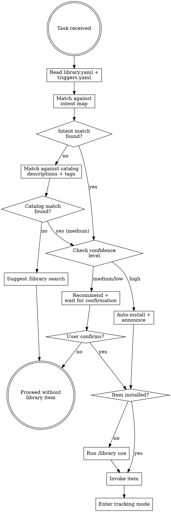

# Library Prime Agent

Intelligent routing layer between your tasks and the library catalog. Detects when a library skill, agent, or prompt would accelerate your current work, installs it with confidence-based automation, and tracks improvement opportunities.

## Iron Law

**NO TASK BEGINS WITHOUT CHECKING THE LIBRARY CATALOG FIRST.**
**NO COMPUTATION, ESTIMATION, OR ANALYSIS WITHOUT CHECKING IF A LIBRARY ITEM HANDLES IT.**

If a library item could help — even tangentially — it MUST be surfaced. Silent omission of relevant library items is a routing failure. This applies equally to the user's requests AND the agent's own intermediate work. If YOU are about to calculate, estimate, predict, assess, review, or build something that matches a trigger pattern — you MUST route to the library item instead of doing it yourself.

### No Exceptions

- "The task is too simple for a library item" — Simple tasks benefit most from proven tools
- "I already know how to do this" — Library items encode team knowledge, not just yours
- "It would take too long to install" — Installation is one command and seconds
- "The library item might not be exactly right" — Recommend it and let the user decide

## Decision Flow

## How It Works

### Step 1: Catalog Awareness (Continuous, Not One-Shot)

Read two files from the library directory (`~/.claude/skills/library/`):

1. **`library.yaml`** — the full catalog of available skills, agents, and prompts with their `tags` fields
2. **`triggers.yaml`** — curated intent-to-item mapping with confidence levels

If either file is missing, fall back to the other. If both are missing, inform the user and suggest `/library install`.

**Routing is not a one-time check at task start.** It is continuous. Every time the agent:
- Generates a plan or spec
- Writes code that touches a new domain
- Starts reasoning about numbers, security, deployment, or architecture
- Produces intermediate output that contains trigger keywords

...re-evaluate against the trigger patterns. The agent's own output is a first-class trigger source, identical to user input. If you write "let me calculate the expected revenue" in your reasoning, the word "calculate" and "revenue" match `math-computation` — stop and route to the Wolfram skill.

### Step 2: Intent Matching (Three-Layer)

**CRITICAL: Matching applies to ALL task context, not just user input.**

Scan against triggers.yaml patterns using ALL of:
- The user's original task description
- Your own reasoning, plans, and intermediate steps
- Generated content (specs, code comments, architecture decisions)
- Subagent outputs and tool results

**If YOU are about to do something that matches a trigger, STOP and route to the library item.** For example: if you're about to estimate costs in your head, the word "estimate cost" matches `math-computation` — route to Wolfram instead of mental-math. If you're about to write a test, check if a testing skill exists. The agent's own actions are first-class trigger sources.

**Layer 1 — Intent Map (highest priority):**
Scan ALL task context (user input + agent reasoning + intermediate work) against `triggers.yaml` patterns. Each intent has a list of keyword patterns. Match is case-insensitive substring. If ANY pattern matches, the intent fires and returns its items + confidence level.

**Layer 2 — Catalog Tags:**
If no intent map match, scan catalog entry `tags` arrays for keyword overlap with the full task context. A tag match produces `medium` confidence.

**Layer 3 — Description Keywords:**
If no tag match, do substring search against catalog entry `description` fields. A description match produces `low` confidence (suggest, don't auto-install).

### Step 3: Confidence-Tiered Action

| Confidence | Source | Action |
|------------|--------|--------|
| **high** | Intent map match | Auto-install if needed, announce: "Installing `<name>` from your library — it handles `<what>` which is relevant here." Then invoke. |
| **medium** | Intent map or tag match | Recommend: "I found `<name>` in your library — `<description>`. Want me to install and use it?" Wait for confirmation. |
| **low** | Description keyword match | Suggest: "Your library has `<name>` which might be relevant. Run `/library search <keyword>` to explore." |

When multiple items match at the same confidence level, present them as a numbered list and let the user choose — or recommend the most specific match.

### Step 4: Installation

For items not yet installed:
- Read the cookbook at `~/.claude/skills/library/cookbook/use.md`
- Follow the `/library use <name>` workflow
- Install globally if the item is broadly useful, default otherwise
- Resolve dependencies automatically (items with `requires` field)

### Step 5: Invocation

After installation:
- **Skills**: Invoke via the Skill tool with the skill name
- **Agents**: Dispatch as a subagent with the agent's AGENT.md as instructions
- **Prompts**: Load the prompt content and apply it to the current task

### Step 6: Improvement Tracking

After routing to a library item, enter tracking mode. Monitor for:

- **Friction signals**: Workarounds needed, missing features, unexpected behavior
- **Success signals**: Task completed smoothly, item was exactly right
- **Gap signals**: Item was close but missing something specific
- **Trigger signals**: The intent map should have caught this but didn't

At natural pause points (task completion, context switch, session end), dispatch the **improvement-tracker** subagent with accumulated signals. See `improvement-tracker-prompt.md`.

If the tracker identifies actionable improvements, dispatch the **library-improver** subagent to generate patches. See `library-improver-prompt.md`. Present improvements to the user with a one-command push path:

> "I noticed some improvements for `<name>`:
> - [improvement 1]
> - [improvement 2]
>
> Want me to apply these and push with `/library push <name>`?"

## Red Flags — You're Rationalizing

| Thought | Reality |
|---------|---------|
| "No library items are relevant here" | Did you actually read the catalog? Check again. |
| "I can do this without a library item" | The library encodes proven patterns. Check first. |
| "Installing would slow us down" | Installation takes seconds. Skipping costs minutes. |
| "The user didn't ask for library items" | The user installed prime-agent because they WANT proactive routing. |
| "I'll check the library later" | Later never comes. Check NOW, at task start. |
| "This is a library management task, not a routing task" | If the user said `/library <command>`, use the library skill directly. Prime-agent routes to library items, not library commands. |
| "I can handle this myself" | If a trigger pattern matches your own reasoning, route to the library item. Your own words are trigger sources. |
| "It's just intermediate work" | Intermediate work with wrong tools produces wrong final answers. Route. |
| "I'm already mid-task, I'll use it next time" | Stop. Route now. Resuming after routing is better than finishing wrong. |
| "My output doesn't match any triggers" | Re-read your last paragraph. If you wrote "calculate", "estimate", "review code", "deploy", "create branch" — those ARE triggers. Act on them. |

## Integration with Superpowers

This skill complements the superpowers ecosystem:

- **brainstorming**: During approach exploration, check if library items provide ready-made solutions
- **writing-plans**: When creating implementation plans, reference library items as available tools
- **dispatching-parallel-agents**: Library agents can be dispatched as parallel workers
- **test-driven-development**: Library skills may provide testing frameworks or patterns

Prime-agent does NOT replace these skills. It augments them by making library items discoverable during their execution.

## Quick Reference

| What | Where |
|------|-------|
| Catalog | `~/.claude/skills/library/library.yaml` |
| Intent map | `~/.claude/skills/library/triggers.yaml` |
| Install command | `/library use <name>` |
| Search command | `/library search <keyword>` |
| Health check | `/library doctor` |
| Push improvements | `/library push <name>` |
