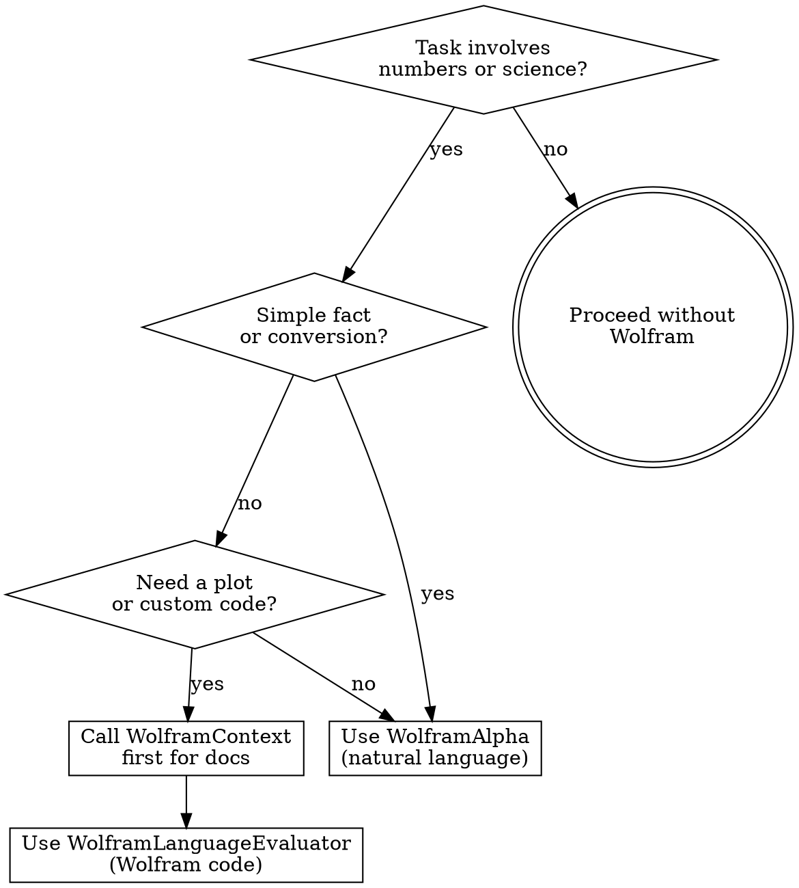

# Wolfram MCP — Computation & Knowledge Engine

Use Wolfram Alpha and Wolfram Language for any task requiring precise mathematics, computation, real-time data, or scientific knowledge. Do NOT attempt complex math in your head — delegate to Wolfram.

## Iron Law

**IF THE TASK INVOLVES COMPUTATION, USE WOLFRAM. DO NOT MENTAL-MATH IT.**

LLMs hallucinate arithmetic. Wolfram does not. Any calculation beyond basic addition should go through Wolfram Alpha or the Wolfram Language Evaluator.

### No Exceptions

- "It's just simple multiplication" — LLMs get 5-digit multiplication wrong 15% of the time. Use Wolfram.
- "I can estimate this" — Estimates are fine for conversation. If the result drives a decision or enters code, use Wolfram.
- "It would take too long" — A Wolfram query takes 2 seconds. A wrong calculation wastes hours.

## Three Tools, Three Use Cases

| Tool | When to Use | Example |
|------|-------------|---------|
| `mcp__wolfram__WolframAlpha` | Natural language queries — math, conversions, real-time data, demographics, weather, finance | "What is the derivative of x^3 * sin(x)?" |
| `mcp__wolfram__WolframLanguageEvaluator` | Programmatic computation — plots, data analysis, symbolic math, custom algorithms | `Plot[Sin[x]/x, {x, -10, 10}]` |
| `mcp__wolfram__WolframContext` | Documentation lookup — find the right Wolfram function before writing code | "How do I do linear regression in Wolfram Language?" |

## Decision Flow



## WolframAlpha — Natural Language Queries

Best for quick answers. Just ask in plain English:

```
"derivative of x^3 * sin(x)"
"convert 500 EUR to GBP"
"population of France vs Germany 2024"
"compound interest on $10000 at 5% for 10 years"
"solve 3x^2 + 2x - 5 = 0"
"weather in Barcelona next week"
"nutritional info for 200g chicken breast"
```

## WolframLanguageEvaluator — Programmatic Computation

For plots, data processing, and complex calculations. **Always call `WolframContext` first** to find the right functions.

```wolfram
(* Statistical analysis *)
data = {23, 45, 12, 67, 34, 89, 56};
{Mean[data], Median[data], StandardDeviation[data]}

(* Linear regression *)
data = {{1, 2.1}, {2, 3.9}, {3, 6.2}, {4, 7.8}, {5, 10.1}};
lm = LinearModelFit[data, x, x];
lm["BestFitParameters"]

(* Plotting *)
Plot[{Sin[x], Cos[x]}, {x, 0, 2 Pi}, PlotLegends -> "Expressions"]

(* Financial modeling *)
TimeValue[Annuity[1000, 20, 1/12], .05/12, 20*12]
```

**Entity resolution:** Always use `\[FreeformPrompt]["query"]` for entity lookup. Never write `Entity["type", "name"]` directly — it breaks on ambiguous names.

```wolfram
(* CORRECT *)
\[FreeformPrompt]["GDP of France"]

(* WRONG — will fail on ambiguous entities *)
Entity["Country", "France"]["GDP"]
```

## Common Task Patterns

| Task | Tool | Query |
|------|------|-------|
| Pricing math | WolframAlpha | "If 1000 API calls cost $0.003 each, what's monthly cost at 2M calls?" |
| Statistical significance | Evaluator | `HypothesisTestData[data1, data2, "TTest"]` |
| Date math | WolframAlpha | "days between March 22 2026 and December 31 2026" |
| Currency conversion | WolframAlpha | "500 EUR to USD" |
| Regex validation | Evaluator | `StringMatchQ["test@email.com", RegularExpression["..."]]` |
| Performance modeling | Evaluator | `Plot` with response time curves |
| Encryption math | WolframAlpha | "256-bit key space size" |
| Color math | WolframAlpha | "complementary color of #3B82F6" |

## Red Flags — You're Rationalizing

| Thought | Reality |
|---------|---------|
| "I can do this math in my head" | You probably can't reliably. Use Wolfram. |
| "It's just an estimate" | If the number enters code or a decision, verify with Wolfram. |
| "Wolfram is overkill for this" | 2-second query vs potential hours debugging a wrong number. |
| "The user didn't ask for precise math" | Deliver precise results by default. Round for presentation. |
