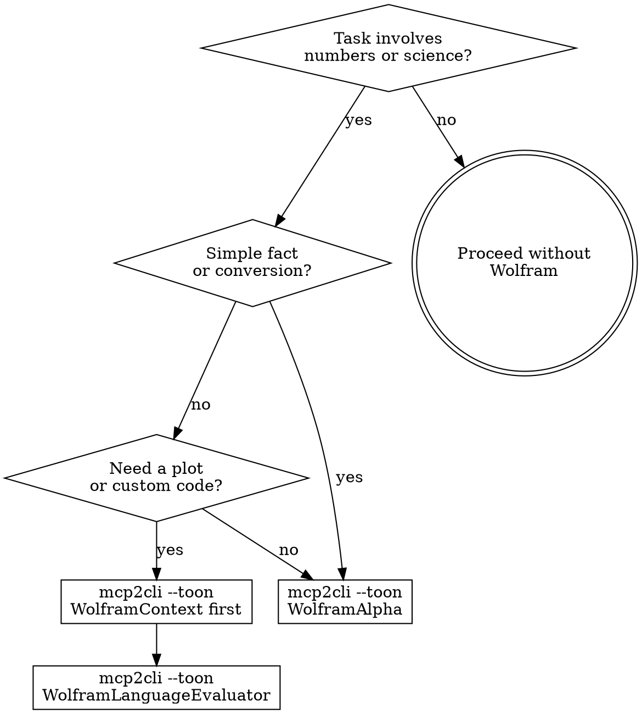

# Wolfram — Computation & Knowledge Engine

Use Wolfram Alpha and Wolfram Language for any task requiring precise mathematics, computation, real-time data, or scientific knowledge. Do NOT attempt complex math in your head — delegate to Wolfram.

## Iron Law

**IF THE TASK INVOLVES COMPUTATION, USE WOLFRAM. DO NOT MENTAL-MATH IT.**

LLMs hallucinate arithmetic. Wolfram does not. Any calculation beyond basic addition should go through Wolfram.

### No Exceptions

- "It's just simple multiplication" — LLMs get 5-digit multiplication wrong 15% of the time. Use Wolfram.
- "I can estimate this" — Estimates are fine for conversation. If the result drives a decision or enters code, use Wolfram.
- "It would take too long" — A Wolfram query takes 2 seconds. A wrong calculation wastes hours.

## Access Method: mcp2cli (Primary)

**Always prefer `mcp2cli` with `--toon` for token-efficient Wolfram access.** This minimizes token cost by 96-99% compared to raw MCP tool calls while delivering identical results.

### Quick Reference

```bash
# WolframAlpha — natural language queries (lowest token cost)
mcp2cli --mcp wolfram --toon WolframAlpha --input '{"input": "derivative of x^3 * sin(x)"}'

# WolframContext — documentation lookup (call BEFORE Evaluator)
mcp2cli --mcp wolfram --toon WolframContext --input '{"query": "linear regression"}'

# WolframLanguageEvaluator — programmatic computation
mcp2cli --mcp wolfram --toon WolframLanguageEvaluator --input '{"code": "Mean[{23,45,12,67,34,89,56}]"}'
```

### Why mcp2cli, Not Raw MCP

| | Raw MCP Tool Call | mcp2cli --toon |
|---|---|---|
| **Token cost** | Full JSON schema + response | Minimized output, ~96% savings |
| **When to use** | Only if mcp2cli unavailable | Always — default method |
| **Batching** | One call at a time | Chain with `&&` for sequential queries |

**Fallback only:** If `mcp2cli` is not available or fails, use the raw MCP tools directly:
- `mcp__wolfram__WolframAlpha` — natural language queries
- `mcp__wolfram__WolframLanguageEvaluator` — Wolfram Language code
- `mcp__wolfram__WolframContext` — documentation search

## Decision Flow



## Three Tools, Three Use Cases

| Tool | mcp2cli Command | When to Use |
|------|-----------------|-------------|
| WolframAlpha | `mcp2cli --mcp wolfram --toon WolframAlpha --input '{"input": "..."}'` | Natural language queries — math, conversions, real-time data, demographics, weather, finance |
| WolframContext | `mcp2cli --mcp wolfram --toon WolframContext --input '{"query": "..."}'` | Documentation lookup — find the right function BEFORE writing Wolfram code |
| WolframLanguageEvaluator | `mcp2cli --mcp wolfram --toon WolframLanguageEvaluator --input '{"code": "..."}'` | Programmatic computation — plots, data analysis, symbolic math, custom algorithms |

## WolframAlpha — Natural Language (Lowest Token Cost)

Best for quick answers. Use for 80% of queries:

```bash
# Calculus
mcp2cli --mcp wolfram --toon WolframAlpha --input '{"input": "derivative of x^3 * sin(x)"}'

# Currency
mcp2cli --mcp wolfram --toon WolframAlpha --input '{"input": "convert 500 EUR to GBP"}'

# Finance
mcp2cli --mcp wolfram --toon WolframAlpha --input '{"input": "compound interest on $10000 at 5% for 10 years"}'

# Equations
mcp2cli --mcp wolfram --toon WolframAlpha --input '{"input": "solve 3x^2 + 2x - 5 = 0"}'

# Real-time data
mcp2cli --mcp wolfram --toon WolframAlpha --input '{"input": "population of France vs Germany 2024"}'

# Date math
mcp2cli --mcp wolfram --toon WolframAlpha --input '{"input": "days between March 22 2026 and December 31 2026"}'
```

## WolframLanguageEvaluator — Programmatic Computation

For plots, data processing, and complex calculations. **Always call WolframContext first** to find the right functions.

```bash
# Step 1: Find the right function
mcp2cli --mcp wolfram --toon WolframContext --input '{"query": "linear regression"}'

# Step 2: Execute the computation
mcp2cli --mcp wolfram --toon WolframLanguageEvaluator --input '{"code": "data = {{1, 2.1}, {2, 3.9}, {3, 6.2}, {4, 7.8}, {5, 10.1}}; lm = LinearModelFit[data, x, x]; lm[\"BestFitParameters\"]"}'

# Statistical analysis
mcp2cli --mcp wolfram --toon WolframLanguageEvaluator --input '{"code": "data = {23, 45, 12, 67, 34, 89, 56}; {Mean[data], Median[data], StandardDeviation[data]}"}'

# Financial modeling
mcp2cli --mcp wolfram --toon WolframLanguageEvaluator --input '{"code": "TimeValue[Annuity[1000, 20, 1/12], .05/12, 20*12]"}'

# Monte Carlo simulation
mcp2cli --mcp wolfram --toon WolframLanguageEvaluator --input '{"code": "SeedRandom[42]; trials = RandomVariate[NormalDistribution[100, 15], 10000]; {Mean[trials], Quantile[trials, {0.05, 0.5, 0.95}]}"}'
```

**Entity resolution:** Always use `\[FreeformPrompt]["query"]` for entity lookup. Never write `Entity["type", "name"]` directly — it breaks on ambiguous names.

## Common Task Patterns

| Task | Tool | Command |
|------|------|---------|
| Pricing math | WolframAlpha | `--input '{"input": "2000000 * 0.003"}'` |
| Statistical significance | Evaluator | `--input '{"code": "HypothesisTestData[data1, data2, \"TTest\"]"}'` |
| Unit economics (LTV/CAC) | WolframAlpha | `--input '{"input": "if monthly revenue per user is $49 and churn is 5%, what is LTV"}'` |
| Currency conversion | WolframAlpha | `--input '{"input": "500 EUR to USD"}'` |
| Growth projections | Evaluator | `--input '{"code": "Table[1000 * 1.15^n, {n, 0, 12}]"}'` |
| Probability | WolframAlpha | `--input '{"input": "probability of at least 3 successes in 10 trials with p=0.3"}'` |
| Break-even analysis | WolframAlpha | `--input '{"input": "solve 49x = 15000 + 12x for x"}'` |
| Confidence intervals | Evaluator | `--input '{"code": "MeanCI[{23,45,12,67,34,89,56}, ConfidenceLevel -> 0.95]"}'` |
| Burn rate / runway | WolframAlpha | `--input '{"input": "if burn rate is $8000/month and cash is $95000, how many months of runway"}'` |

## Token Cost Comparison

A typical Wolfram query:
- **Raw MCP**: ~2,000-5,000 tokens (schema + full JSON response)
- **mcp2cli --toon**: ~50-200 tokens (compressed output only)
- **Savings**: 96-99% per query

Over a session with 10 Wolfram queries, that's **~45,000 tokens saved** — roughly 5% of a 1M context window preserved for actual work.

## Red Flags — You're Rationalizing

| Thought | Reality |
|---------|---------|
| "I can do this math in my head" | You probably can't reliably. Use Wolfram via mcp2cli. |
| "It's just an estimate" | If the number enters code or a decision, verify with Wolfram. |
| "Wolfram is overkill for this" | 2-second query via mcp2cli vs potential hours debugging a wrong number. |
| "The user didn't ask for precise math" | Deliver precise results by default. Round for presentation. |
| "I'll use the raw MCP tools" | Use mcp2cli --toon first. Save tokens. Only fall back to raw MCP if mcp2cli fails. |
| "mcp2cli adds complexity" | It's one bash command. The complexity is in the math you're avoiding. |
